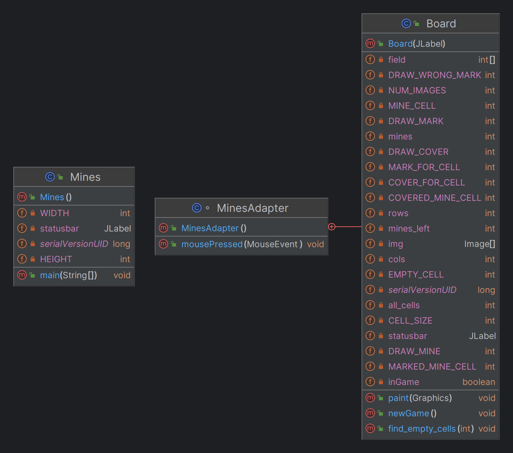
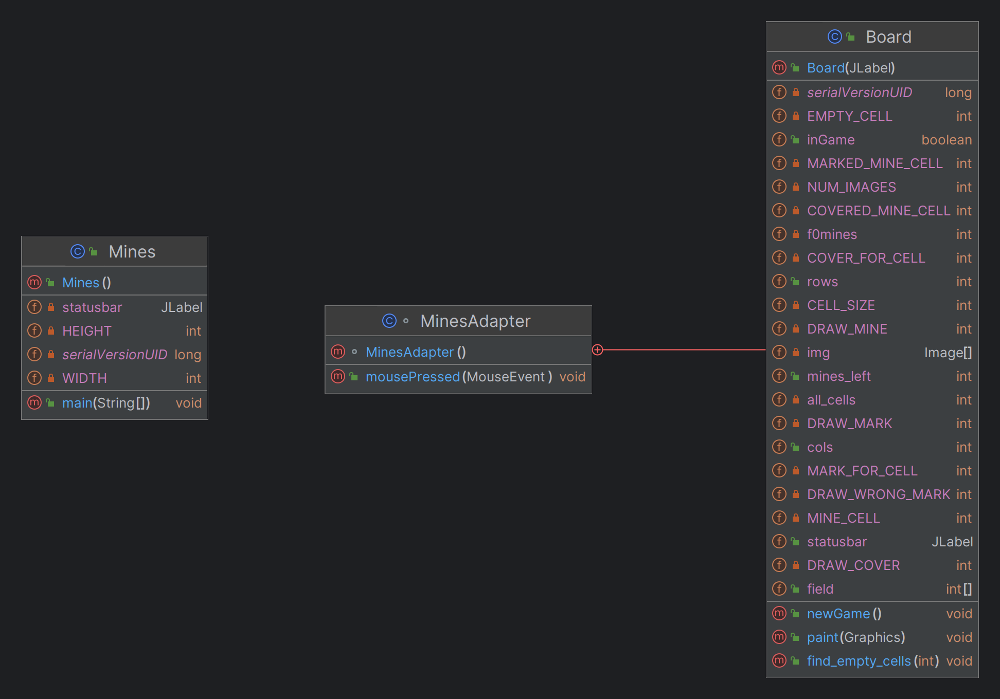

<p align="center">
<h1> Retroingenierie <h1>
<h2> Auteurs <h2>
<h4>Sem Saada Khelkhal</h4>
<h4>Labraoui Mohamed Wassim<h4>
</p>

- [Retro-ingénirie](#retro-ingénirie)
  - [Classe Mine](#classe-mine)
  - [Class Board](#class-board)
  - [Decompilation par fichier .jar](#decompilation-par-fichier-jar)
- [Retro-conception](#retro-conception)


# Retro-ingénirie

cette section portera sur la comparaison entre le code ecrit manuellement et le code generer par la décompilation des fichier .class. 5 decompilateurs seront utiliser qui sont : CFR, Fernflower, Jadx, JDCore, Procyon ,afin mettre en lumiére les différence entre chaqu'un d'entre eux.

## Classe Mine
la seule différence remarquable sur cette classe entre le code source et les codes decompilé se trouve dans le constructeurs.

**Code source:**
```java
public Mines() {
  setDefaultCloseOperation(JFrame.EXIT_ON_CLOSE);
  setSize(WIDTH, HEIGHT);
  setLocationRelativeTo(null);
  setTitle("Minesweeper");
  statusbar = new JLabel("");
  add(statusbar, BorderLayout.SOUTH);
  add(new Board(statusbar));
  setResizable(false);
  setVisible(true);
}
```

**code decompilé**

```java
public Mines() {
  this.setDefaultCloseOperation(3); // (1) (3)
  this.setSize(250, 290); // (1) (3)
  this.setLocationRelativeTo(null); // (3)
  this.setTitle("Minesweeper"); // (3)
  this.add(this.statusbar = new JLabel(""), "South"); // (1) & (2) & (3)
  this.add(new Board(this.statusbar)); // (3)
  this.setResizable(false); // (3)
  this.setVisible(true); // (3)
}
```

* (1) : l'on peut constaté le remplacement systématique des constantes par des variable inline (`Height` par `290` par exemple).
* (2) : l'initialisation de l'attribut statusbar se fait dans la mémé ligne que l'ajout de la statusbar au ui.
* (3) : l'utilisation systematique de `this` lors de l'accés aux attributs et méthods de la class. 


## Class Board

La quasi totalité du code du projet se trouve dans la class board ce qui rends la comparaison entre les deux version de cette class plus importante et remarquable.

pour des raison de briévetés le code sera decoupé en plusieurs section comparable.

les différence notable génerals parmis tous les decompilateurs:

1. remplacement de l'utilisation des constantes par leurs valeurs.
2. remplacement toutes instance de post incrémentation (`i++` par exemple) par une préincrementation (`++i` par exemple).
3. joindre la declaration et l'affectation d'une variable le plus proche de sont utilisation.
4. concaténation des condition des `if` concecutive en une seule expression lorsqu'il est possible.

**Explication:** le fait d'avoir des différence en commun parmis les décompilateurs permet de deduire la présence de ces changement dans la compilation initials (dans les fichier .class) qui sont effectuer pour augmenter les performance et la brieveter du code résultant tous en permétant au programmeur d'ecrire du code plus expressive sans ce soucier de ces optimisation.

les différences notable entre les décompilateur:

1. *CFR:*
   1. declaration d'une variable intermédiaire avant l'accés au tableau.
   2. utilisation de `continue` dans les boucles.
2. *Jadx:*
   1. présence de commantair pour expliquer les changement.
   2. changement des attribut non constant de privé a public.
   3. renomation de certains attributs.
   4. la creation de méthods public dites "synthetic" utilisé pour communiquer avec la class MouseAdapter.
3. *JDCore:*
   1. contredits la régle de transformation des post-incrementation en pré-incrementation.
4. *Procyon:*
   1. declaration d'une variable intermédiaire avant l'accés au tableau.
5. *Fernflower:*
   1. creation de copy de références au objet avant d'y accéder.
   2. double instantiation de variable soulever comme erreurs par les IDEs.

##  Decompilation par fichier .jar

la decompilation en utilisant le fichier .jar offre aucune différence en comparaison avec la decompilation par fichier .class pour chaque decompilateurs respective.

ceci peut étre expliquer par la definition du fichier .jar qui est

> un fichier JAR (Java archive) est un fichier ZIP utilisé pour distribuer un ensemble de classes Java
> 
> --- [Traduit depuis Oracle](https://docs.oracle.com/javase/10/docs/specs/jar/jar.html)

ce qui explique que les fichiers .jar ne sont qu'un moyen de compréssé plusieur fichier class en un seul fichier en plus de métadonné qui sont extrait par certain décompilateur (JADX et CFR).

# Retro-conception

le diagramme et generer en utilisant l'IDE intelliJ

<p align="center">
  
  <b>generer depuis le code source</b>
</p>

<p align="center">
  
  <b>generer depuis le code decompiler</b>
</p>

les différence notable entre les deux version sont :

* l'ordre des declaration des attributs et méthods est différant.
* certains attributs et méthodes ont un nom différent (`mines` devenus `f0mines`)

le reste est identique.


